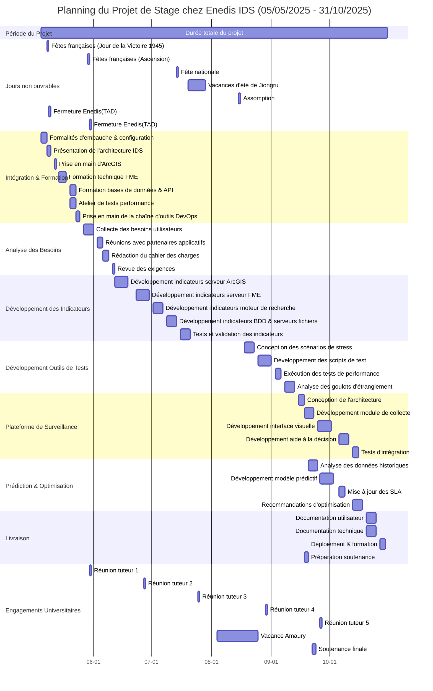

# **Rapport d'installation**

## **1. Contexte de l'entreprise et intégration**

### 1.1 Présentation d'Enedis

#### **Mission en bref**  

Enedis est le principal gestionnaire du réseau électrique français, responsable de **95% des infrastructures** (couvrant environ 14 000 km de réseaux basse et moyenne tension). Ses missions clés incluent :  

##### **Gestion et optimisation du réseau** :

- Amélioration de la fiabilité via la digitalisation (ex. déploiement des compteurs Linky), soutien à la transition énergétique et à l'intégration des énergies vertes.  

##### **Garantie du service public** :

- Alimentation électrique ininterrompue pour 37 millions de clients, conformité réglementaire (RGPD, cybersécurité) et défis écologiques (neutralité carbone).  

#### **Rôle central de la Géomatique chez Enedis**  

Le Système d'Information Géographique (SIG) est un pilier opérationnel :  

1. ##### Gestion des données géospatiales :  

     - **80+ To** de données (topologie du réseau, équipements, cartographie) alimentant **40+ applications** (ex. SIG Elec, GEMap).  

     - Maintenance des modèles numériques **Grande Échelle** et **Moyenne Échelle**.  

2. ##### Diagnostic et réparation :  

     - Outils mobiles (e-Maps/MaCarto) pour mise à jour en temps réel, réduisant les délais d'intervention.  

     - Croisement de données via **Datalake B4ALL** (météo, état du réseau).  

3. ##### Maintenance préventive :  

     - Automatisation des processus (ex. élimination des saisies doubles), mise à jour des fonds cartographiques via **ForMap**.  

     - Conformité réglementaire (ex. système DT-DICT pour prévenir les dommages aux câbles).  


### 1.2 Département/Équipe d’accueil

#### **Nom du département**

Direction des Systèmes d’Information (DSI) - Train Géomatique  

#### **Fonctions et structure**

1. ##### **Périmètre** :

     - Gestion du cycle de vie des SIG (développement, maintenance, support utilisateur).  

     - Projets clés : **MJBDP** (base de données des actifs), **iDIOME** (collecte mobile), **standardisation GE/ME**.  

2. ##### **Composition** :

     - 150 membres : **PO** (priorisation), **Scrum Master** (méthodologie agile), **Gestionnaires d’Application** (support via SPICE).  

     - Collaboration étroite avec **DT** (Direction Technique) et **CEN** (représentants régionaux).  


### 1.3 Mode de collaboration et architecture organisationnelle

#### **Cadre agile (SAFe)**

Méthodologie **SAFe** (Scaled Agile Framework) avec :  
1. **Planification trimestrielle (PI Planning)** : 

   ​	Alignement inter-équipes (ex. coopération avec IDS).  

2. **Rôles clés** :  

     - **PO** : Priorisation des besoins (ex. stabilité des données SIG).  

     - **DevOps** : Pipeline CI/CD pour données statiques.  

#### **Collaboration transverse**  
1. **Synergies** :  

     - **IDS** : Fourniture d'interfaces standardisées (modèles GE/ME).  
     - **Réunions mensuelles Train Géomatique** : Gestion des risques.  
2. **Outils** :  

     - **SPICE** : Traitement centralisé des remontées utilisateurs.  

     - **Portes ouvertes DSI** : Dialogue direct avec les métiers.  


#### **Écosystème**

  - **Partenariats** : Capgemini/Coexya pour le développement sur mesure.  

  - **Double rôle** : Maîtrise d'ouvrage (définition des standards) et prestation de services.  

------

### 1.4 Environnement professionnel et modalités de travail

#### **Transformation du secteur SIG**  
1. **Nouvelles applications** :  

     - **Énergie** : Jumeaux numériques pour la transition écologique.  
     - **Mobilité** : Cartographie pour véhicules autonomes.  
2. **Choix de carrière** :  
     - **Stabilité** en maîtrise d'ouvrage vs. **diversité** en consulting.  

#### **Flexibilité organisationnelle**  
1. **Télétravail**(Stagiaire ne concerne pas) :  

     - Mode hybride (Paris/Lyon/Nantes) avec outils Teams/SPICE.  
     - Surveillance 24/7 via **Météore**.  
2. **Culture d'entreprise** :  

     - Autonomie des équipes régionales.  

     - Horaires flexibles pour équilibre vie pro/perso.  


### 1.5 Installation matérielle et logistique

#### **Environnement de travail**

- **Matériel attribué** :
  
  - Ordinateur portable professionnel avec infrastructures bureautiques 
  - Environnement logiciel prédéfini :
    - IDE : VS Code avec extensions Python + Bash
    - Contrôle d'accès(The principle of least privilege) :
      * Interdiction d'installer des bibliothèques Python dehors d’image entreprises (Python + packages d'entreprise par Antifactory)
      * Extensions sur Browser
      * Processus de validation en cascade pour des gestions des infrastructures et des autorisations 
  
- **Outils collaboratifs** :
  | Catégorie | Outils | Usage observé |
  |---|---|---|
  | Communication | Microsoft Teams + Outlook | Notification des commits,  réunions quotidiennes |
  | Gestion de projet | Jira + Confluence | Suivi des tickets, documentation technique |
  | Développement | GitLab | Versionnement et livration des produits, CI/CD pipelines, des tests automatiques |

#### **Processus d'intégration**

- **Formation technique (Semaine 1-2)** :
  - Modules e-Campus obligatoires :
    * Sécurité des données (scénarios de phishing simulés)
    * Standards géodésiques ENEDIS_L93
  - Ateliers pratiques :
    * Configuration des pipelines GitLab
    * Utilisation des rôles Ansible Galaxy pour le déploiement
    * Tirs de performance(Benchmark + Replay)
  
- **Support hiérarchique** :
  > _"Mon responsable Cyril et mon tuteur Philippe ont anticipé les demandes d'accès nécessaires (accès des services, des autorisations au référentiel DevOps), ce qui a réduit beaucoup du temps de prise en main"_

#### **Aménagements annexes**

- **Services internes** :
  - Restaurant d'entreprise avec tarif stagiaire
  - Salle de sport située au sous-sol
  - Distributeurs de collations dans les espaces communs

- **Observations organisationnelles** :
  
  - Paradoxe technologique :
    ```mermaid
    graph LR
      A[Attentes] --> B[Gestion des données noSQL/SQL automatique]
      C[Réalité] --> D[Utilisation intensive d'Excel Manuellement]
      B -.->|écart| D
    ```
    
    ​									Diagram A1
    
  - Adoption mesurée de l'IA :
    
    - GitHub Copilot Enterprise pour l'assistance au codage (Néanmoins pas encore des applications IA sur DevOps)
    - Projet de migration cloud en phase de test (non déployé)

## **2. Reformulation du sujet de stage**

### **2.1 Objectifs initiaux **

#### 1.Monitoring & Performance :

- Développer et déployer des métriques de charge (serveurs
  ArcGIS/FME, bases de données, flux réseau).
- Analyser les résultats de tests de performance (tirs d'étalonnage) pour identifier les goulets d'étranglement. 

#### 2.Outillage DevOps : 

- Concevoir un dashboard centralisé (type Grafana ou outil
  interne) agrégeant les métriques et résultats de tests. 
- Automatiser des rapports décisionnels pour les mises en production (GO/NO GO). 

#### 3.Collaboration transverse : 

-  Appuyer les équipes d'exploitation dans la prévision de
  volumétries et la gestion des contrats de service. 
- Proposer des optimisations d'allocation des ressources (CPU,
  mémoire, stockage) avec les architectes. 

#### 4.Documentation : 

- Capitaliser les bonnes pratiques de capacity planning et
  rédiger des guides techniques.

## **3. Description des tâches et solutions techniques**

### **3.1 Tâches principales**

#### **Contexte**

Mon stage au sein de l'équipe IDS (Infrastructure de Données Spatiales) d'Enedis vise à établir un processus systématique de **capacity planning**, garantissant la scalabilité des infrastructures face à une charge croissante (**180+ millions d'appels hebdomadaires**).  

#### **Responsabilités clés**

1. **Développement et déploiement de systèmes de monitoring (P0)**  
   - **Objectif** : Concevoir des indicateurs de performance (capacité/charge) pour les composants IDS（mini excel) :  
     - Serveurs ArcGIS/FME  
   - **Stack technique** :  
     - Outils : Grafana (métriques)  
     - Scripts personnalisés (Excel + Python[Ansible]/Bash + Gitlab CI) pour l'extraction de données  
   - **Résultats attendus**:
     - Dashboard Grafana
     - Pipelines automatiques
2. **Optimisation des infrastructures(P1) (v0 de 3)**  
   - **Actions** :  
     - Ajustement des configurations serveur (CPU/RAM/storage)  
     - Planification des montées en charge (scale-up/scale-out)  
   - **Environnement** :  
     - Capacity Planning : VM (Arcgis + FME)  —> sortie en Excel
3. **Support aux tests de performance(P2)**  
   - **Missions** :  
     - Exécution de tests d'étalonnage + de rejeu (**benchmarks** + **replay**)  
     - Pipelines pour automatiser des lancementS de machine et des tests
   - **Stack technique** : 
     - JMeter (tests de charge),  
     - Python[Ansible, Pandas] 
   - **Résultats attendus**:
     - Pipeline automatique
4. **Outil centralisé d'aide à la décision(P2)（a interne mais aux plus grand publique）**  
   - **Livrable** : Une solution unifiant :  
     - Métriques de monitoring  
     - Résultats des tests  
     - Critères GO/NO GO pour les déploiements  
   - **Stack technique** :  
     - Backend : Django
     - Base de données : PostgreSQL/InfluxDB  
     - Automatisation : N8N (ANALYSE rapports avec IA) 
   - **Résultats attendus**:
     - Dashboard(visualisation depuis des analyses de résultat de 3) 
5. **Prévision de capacité et gestion des SLA(P3)**  
   - **Activités** :  
     - ¨Modélisation¨ de la croissance des requêtes (régression, séries temporelles)  depuis 4eme
     - Négociation des SLA avec les partenaires techniques  
   - **Compétences** :  
     - Base de données : InfluxDB  
     - Analyse statistique : Python
     - Coordination inter-équipes     


------

#### **Valeur métier**

  - **Impact opérationnel** :  
    - Amélioration de la stabilité des services géomatiques critiques (ex. SIG Elec)  
    - Réduction des risques de saturation (+15% d'efficacité ressources)  
  - **Apprentissages clés** :  
    - Maîtrise des pipelines CI/CD et de l'IaC (Ansible)  
    - Expérience transverse (devops, data engineering, gestion de projet)  

------

#### **Synthèse**

  Ce rôle combine :  
  - **Ingénierie système** (monitoring, scaling)  
  - **Développement full-stack** (outils décisionnels)  
  - **Collaboration métier** (SLA, planification)  
    Offrant une immersion dans les coulisses des infrastructures géodata d'un acteur énergétique majeur.  

## **4. Planification prévisionnelle**

#### **4.1 Calendrier des phases **



```mermaid
gantt
  title Planning du Projet de Stage Enedis IDS (05/05/2025 - 31/10/2025)
  dateFormat  YYYY-MM-DD
  axisFormat %m-%d
  tickInterval 7day
  
  %% Configuration visuelle
  section
  todayMarker off
  tickInterval 1week
  
  %% Jours non travaillés
  section Absences
  Fête du Travail : milestone, 2025-05-01, 0d, color=#FFD700
  Victoire 1945 : milestone, 2025-05-08, 0d, color=#FFD700
  Ascension : milestone, 2025-05-29, 0d, color=#FFD700
  Fête Nationale : milestone, 2025-07-14, 0d, color=#FFD700
  Vacances été : milestone, 2025-07-20, 0d, color=#FFD700
  Assomption : milestone, 2025-08-15, 0d, color=#FFD700
  
  %% Phases principales
  section Phase 1 - Monitoring
  Définition KPIs : crit, active, 2025-05-12, 5d
  Intégration Grafana : 2025-05-18, 7d
  
  section Phase 2 - Optimisation
  Audit serveurs : after Définition KPIs, 2025-06-02, 5d
  Tests scale-up : crit, active, 2025-06-09, 8d
  
  section Phase 3 - Validation
  Benchmarks : after Tests scale-up, 2025-07-01, 10d
  
  %% Dépendances
  Intégration Grafana->Audit serveurs : 3j buffer
  Tests scale-up->Benchmarks : lien critique
```


​									Diagram A2

---

## **Glossaire des Termes Techniques**

| **Terme/Abbréviation** | **Type**         | **Définition/Explication**                                   |
| ---------------------- | ---------------- | ------------------------------------------------------------ |
| **Enedis**             | Organisation     | Gestionnaire du réseau électrique français (95% du réseau), responsable de la distribution. |
| **SAFe**               | Méthodologie     | *Scaled Agile Framework* : Cadre agile pour la gestion de projets à grande échelle. |
| **RGPD**               | Réglementation   | Règlement Général sur la Protection des Données (équivalent européen du GDPR). |
| **SIG**                | Technologie      | *Système d'Information Géographique* : Outil de gestion de données géospatiales. |
| **CI/CD**              | Processus        | *Continuous Integration/Continuous Delivery* : Automatisation des livraisons logicielles. |
| **PO**                 | Rôle             | *Product Owner* : Responsable de la priorisation des besoins utilisateurs en agile. |
| **DevOps**             | Rôle/Philosophie | Pratiques visant à unifier développement et opérations informatiques. |
| **SLA**                | Contrat          | *Service Level Agreement* : Engagement de performance entre fournisseur et client. |
| **B4ALL**              | Outil interne    | Datalake d'Enedis intégrant données météo, réseau et opérationnelles. |
| **MJBDP**              | Projet interne   | *Modèle de Jeu de Données Partagé* : Base de données centralisée des actifs réseau. |
| **iDIOME**             | Projet interne   | Outil mobile de collecte de données géolocalisées pour les techniciens. |
| **SPICE**              | Outil interne    | Plateforme de gestion centralisée des remontées utilisateurs et incidents. |
| **ForMap**             | Outil interne    | Système de mise à jour automatisée des fonds cartographiques. |
| **DT-DICT**            | Processus        | *Dommage Travaux/Déclaration d'Intention de Commencement de Travaux* : Protocole anti-dégâts. |
| **ArcGIS**             | Logiciel         | Plateforme SIG d'Esri utilisée pour l'analyse et la visualisation spatiale. |
| **FME**                | Logiciel         | *Feature Manipulation Engine* : Outil d'ETL pour transformations de données géospatiales. |
| **Grafana**            | Outil            | Solution open-source de visualisation de métriques et monitoring. |
| **JMeter**             | Outil            | Logiciel open-source de tests de performance applicative.    |
| **Ansible**            | Outil            | Plateforme d'automatisation des configurations et déploiements (IaC). |
| **InfluxDB**           | Base de données  | Base de données temporelles optimisée pour les métriques en temps réel. |
| **VM**                 | Infrastructure   | *Machine Virtuelle* : Environnement virtualisé pour l'exécution de services. |

------

### **Légende des Catégories**

- **Organisation** : Acteurs institutionnels ou entreprises
- **Méthodologie** : Cadres de travail ou processus
- **Réglementation** : Lois ou normes contraignantes
- **Technologie** : Solutions techniques génériques
- **Rôle** : Fonctions professionnelles
- **Projet interne** : Initiatives spécifiques à Enedis
- **Outil interne** : Applications développées en interne
- **Logiciel** : Solutions commerciales ou open-source
- **Infrastructure** : Composants matériels/logiciels

